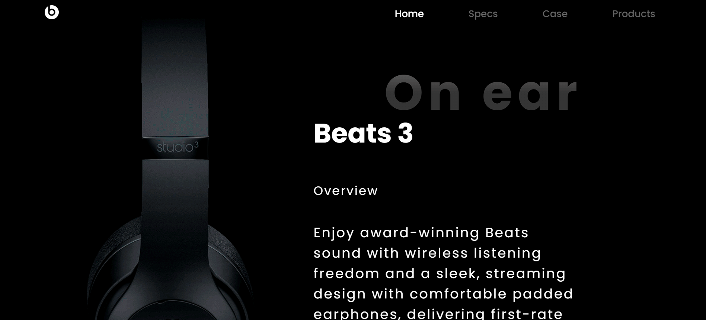
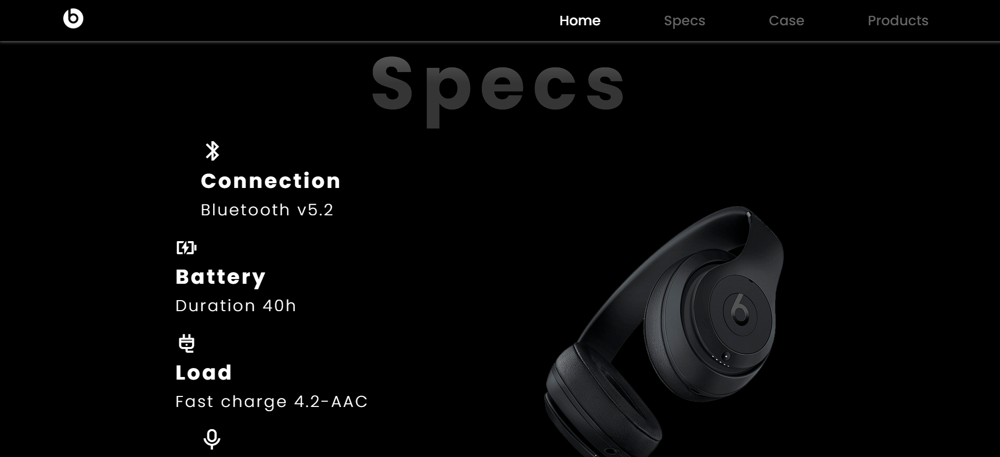
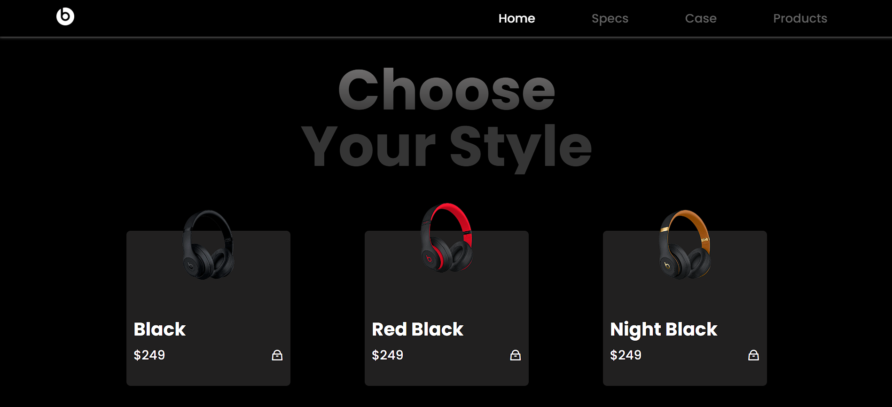
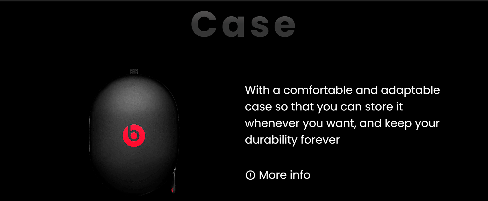

# HEADPHONES

A modern, responsive landing page for premium headphones, featuring product highlights, specifications, and a sleek shopping experience.

## Features
- **Home Section:** Eye-catching hero with product overview and sponsors.
- **Specs Section:** Detailed technical specifications with icons.
- **Case Section:** Product case details and promotional offer.
- **Products Section:** Multiple product styles with images and pricing.
- **Animated UI:** Smooth scroll animations powered by [AOS](https://michalsnik.github.io/aos/).
- **Responsive Design:** Optimized for all devices.
- **Professional Footer:** Clean, fixed footer with copyright.

## Screenshots

| Home | Specs | Case | Products |
|------|-------|------|----------|
|  |  |  |  |

## Getting Started

1. Clone or download this repository.
2. Open `index.html` in your browser.
3. All assets are included locally; no build step required.

## Technologies Used
- HTML5
- CSS3
- JavaScript (ES6)
- [Remix Icon](https://remixicon.com/)
- [AOS Animation](https://michalsnik.github.io/aos/)

## Folder Structure
```
HEADPHONES/
├── index.html
├── index.css
├── index.js
├── img/
│   └── [images]
├── screenshot/
│   ├── 1.png
│   ├── 2.png
│   ├── 3.png
│   └── 4.png
```

## License
© 2025 AudioCraft. All rights reserved.
